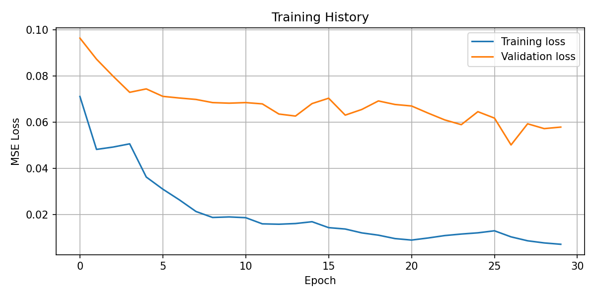
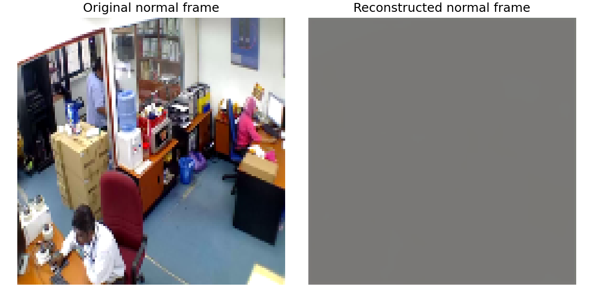
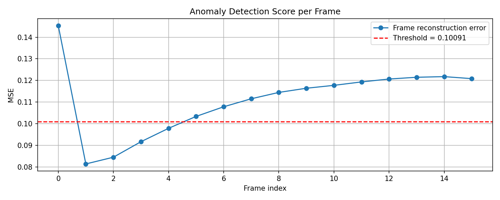

# 🕵️ CCTV Anomaly Detection with a ConvLSTM Autoencoder

A notebook-based learning project for unsupervised anomaly detection in CCTV footage using a **ConvLSTM Autoencoder**.

The model learns what **normal video behaviour** looks like by trying to reconstruct short clips from normal CCTV footage. When it sees something that does not fit that learned pattern, reconstruction gets worse, and the **reconstruction error** goes up. That error becomes the anomaly signal.

This project was rebuilt from a simple script into a more transparent notebook workflow so each step can be inspected, explained, and saved as visible output.

---

## Project goal

The goal of this project was not to build a production surveillance system.

The goal was to understand the working principle of **reconstruction-based anomaly detection** from first principles:

- how video clips are turned into tensors
- how a ConvLSTM processes spatial and temporal information together
- how an autoencoder learns normal patterns
- how reconstruction error can be used to flag unusual frames

---

## What this project does

The notebook workflow does the following:

1. loads short clips from the CCTV dataset
2. trains a ConvLSTM autoencoder on **normal** footage only
3. reconstructs the same kind of clips after training
4. computes per-frame reconstruction error using **Mean Squared Error**
5. estimates a threshold from normal reconstruction errors
6. tests the model on anomaly clips such as **assault**
7. saves plots and frame outputs for inspection

---

## Dataset

This project uses the Kaggle dataset:

**Real Time Anomaly Detection in CCTV Surveillance**  
Contains videos across multiple folders such as:

- `normal`
- `assault`
- `burglary`
- `fighting`
- `shooting`

For this notebook version, I worked with a **small local subset** instead of the full dataset. That made it easier to debug paths, inspect results, and understand the pipeline properly before scaling.

### Local folder structure used

```text
cctv-anomaly-detection/
├── data/
│   └── cctv_subset/
│       ├── normal/
│       ├── assault/
│       ├── burglary/
│       ├── fighting/
│       └── shooting/
├── notebooks/
│   └── cctv_anomaly_detection.ipynb
├── outputs/
│   ├── frames/
│   ├── plots/
│   └── videos/
├── requirements.txt
└── README.md
```

---

## Model idea in plain English

This project uses a **ConvLSTM Autoencoder**.

### Autoencoder
An autoencoder is a model that tries to reproduce its own input.

If you give it a normal clip during training, it tries to rebuild that same clip at the output.

### ConvLSTM
ConvLSTM combines two ideas:

- **convolution**, which helps the model understand image structure such as edges, shapes, and textures
- **LSTM-style memory**, which helps the model follow what changes across time

That makes ConvLSTM a useful choice for video, because video is not just one image. It is a sequence of images changing over time.

### Why anomaly detection works here
If the model trains on normal footage, it usually gets better at reconstructing normal scenes.

When it sees something more unusual, reconstruction often gets worse.

That gap shows up as **higher reconstruction error**.

---

## Notebook workflow

The notebook walks through the project step by step:

- path setup and folder checks
- video inspection
- frame extraction
- clip building
- ConvLSTM autoencoder construction
- training on normal clips
- reconstruction on normal clips
- threshold estimation
- anomaly testing
- saving plots and frames for GitHub-ready outputs

---

## Saved results

### 1. Sample normal frame

This is one frame extracted from a normal CCTV clip after preprocessing.


---

### 2. Training loss

This plot shows the training and validation loss during model training.

A downward trend suggests the model is learning to reconstruct normal clips better over time.



---

### 3. Original vs reconstructed normal clip

This figure compares the first original normal frame with the first reconstructed normal frame.

This is the main visual check for whether the model learned anything useful at all.



---

### 4. Anomaly score plot

This plot shows the per-frame reconstruction error on an anomaly clip.

The red dashed line is the threshold estimated from normal reconstruction errors. Frames above that line are treated as suspicious.



---

## Outputs saved by the notebook

The notebook saves outputs to these folders:

- `outputs/frames/`
- `outputs/plots/`
- `outputs/videos/`

Typical saved files include:

- sample extracted frames
- training loss plots
- original vs reconstructed comparisons
- anomaly score plots
- flagged anomaly frames

---

## How to run

### 1. Open the project folder in VS Code

Open:

```text
computer-vision-projects/cctv-anomaly-detection
```

### 2. Make sure the dataset subset is in place

Put your local video subset inside:

```text
data/cctv_subset/
```

### 3. Install dependencies

Install the packages listed in `requirements.txt`.

### 4. Open the notebook

Open:

```text
notebooks/cctv_anomaly_detection.ipynb
```

Run the cells from top to bottom.

---

## Why this version uses a small subset

The full dataset is very large. For a first clean implementation, using a small subset made more sense.

That helped with:

- faster testing
- easier debugging
- lower storage pressure
- clearer understanding of the model behaviour
- quicker generation of proof images for the README

This version is meant to teach the pipeline properly before scaling.

---

## Limitations

This is a useful learning baseline, but it has obvious limits:

- it uses a small subset, not the full dataset
- the model can react badly to lighting changes, blur, and camera motion
- thresholding is still simple
- it is not formally evaluated with metrics like ROC-AUC
- reconstruction-based anomaly detection can produce false positives
- training on very few normal clips can make the model brittle

So this should be read as a **learning project**, not a polished surveillance product.

---

## What I learned from this project

This project helped me understand, in a practical way:

- how video data is represented in machine learning
- why tensor shapes matter so much
- why file handling and dataset structure break projects faster than model code
- how ConvLSTM differs from image-only models
- why reconstruction quality matters in anomaly detection
- why visible outputs make a GitHub project far more believable than code alone

---

## Next improvements

Good next steps for this project would be:

- train on more normal clips
- sample clips from different parts of each video
- test across more anomaly categories
- compare normal and anomaly error distributions more carefully
- add sliding-window inference for longer videos
- try stronger spatiotemporal backbones
- add evaluation against labelled anomaly intervals if available

---

## Responsible use

This project is for learning and defensive computer vision research.

Any use of CCTV or surveillance footage should respect privacy, consent, and local law.

---

## Repository note

This notebook-based version replaces the earlier script-first workflow with a more transparent and explainable process. The focus is understanding, visible outputs, and cleaner project presentation.
