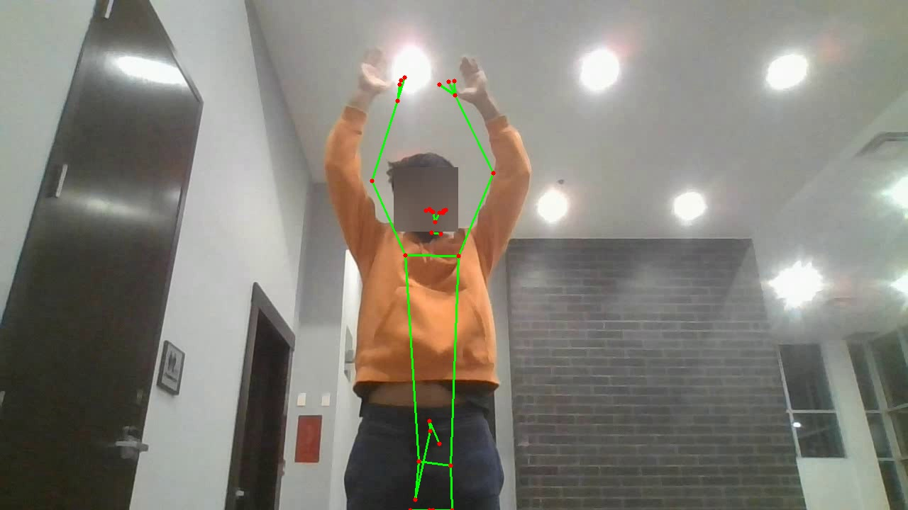
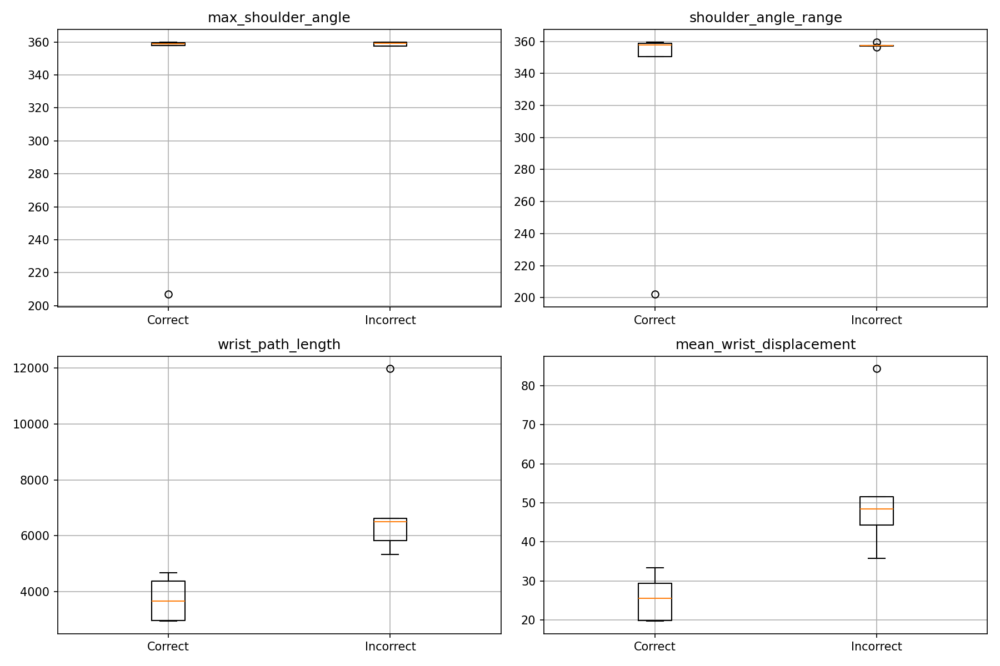

# 🏋️ Arm Raise Rehabilitation Analysis


A notebook-based computer vision project for analysing **arm raise rehabilitation exercises** from video.

This project uses **MediaPipe Tasks Pose Landmarker** to extract upper-limb landmarks frame by frame, then turns those landmarks into simple movement signals such as **shoulder angle**, **elbow angle**, **wrist trajectory**, and **repetition structure**.

I built it as a small, focused movement-analysis pipeline. Not a generic pose demo. The point is to move from raw video to something I can actually inspect and reason about: movement range, path, repetition, and visible differences between **correct** and **incorrect** exercise patterns.

---

## ✨ What this project does

Using a small subset of arm raise videos, the notebook:

- loads selected exercise videos
- detects body landmarks with **MediaPipe Tasks**
- extracts upper-limb points such as:
  - shoulder
  - elbow
  - wrist
  - hip
- computes movement features over time
- compares **correct** and **incorrect** arm raise videos
- saves plots, frames, and CSV outputs for inspection

### Movement features used

This version computes:

- 📈 **Shoulder angle over time**
- 📉 **Elbow angle over time**
- ✋ **Wrist trajectory**
- 📏 **Wrist path length**
- 🔄 **Simple repetition counting from angle peaks**
- 📊 **Per-video summary features** for group comparison

These are not clinical measurements. They are lightweight movement proxies extracted from monocular RGB video.

---

## 🎯 Why I built this

A system can show an exercise. That is only half the job.

The harder question is this: **how do I measure what the person actually did?**

This notebook is my first answer to that problem. I wanted a simple pipeline that could turn rehabilitation-style arm raise videos into measurable movement signals, then check whether those signals showed meaningful differences between **better** and **worse** execution.

So this repo is not about drawing a skeleton on a person and stopping there. It is about building a first behavioural analysis layer from video.

---

## 📦 Dataset

This project uses a small subset of the **WLU Rehabilitation Posture** dataset from Kaggle.

For this version, I only used:

- **5 videos** from `Arm Raise Correct`
- **5 videos** from `Arm Raise Incorrect`

That narrow scope is deliberate. It keeps the notebook readable, the outputs easier to inspect, and the movement comparison easier to explain.

### Expected folder structure

```text
rehab-pose-analysis/
├── data/
│   └── wlu-rehabilitation-posture/
│       └── Blurred/
│           ├── Arm Raise Correct/
│           │   ├── 11.mp4
│           │   ├── 110.mp4
│           │   ├── 111.mp4
│           │   ├── 112.mp4
│           │   └── 113.mp4
│           └── Arm Raise Incorrect/
│               ├── 01.mp4
│               ├── 010.mp4
│               ├── 011.mp4
│               ├── 012.mp4
│               └── 013.mp4
├── models/
│   └── pose_landmarker.task
├── notebooks/
│   └── arm_raise_rehab_analysis.ipynb
├── outputs/
│   ├── csv/
│   ├── frames/
│   ├── plots/
│   └── videos/
├── README.md
└── requirements.txt
```

---

## 🧠 Approach

The notebook follows this flow:

1. Load one or more arm raise videos
2. Run **Pose Landmarker** on each frame
3. Save landmark coordinates into a dataframe
4. Compute simple movement features from those landmarks
5. Summarise each video into a small feature table
6. Compare the **correct** and **incorrect** groups

For this task, I mainly use the right-side landmarks:

- right shoulder
- right elbow
- right wrist
- right hip

That is enough to get useful first-pass movement signals for arm raise analysis.

---

## 📊 Results

On this 10-video subset, the path-based features turned out to be more informative than the peak-angle features.

### What stood out

- **Incorrect** videos showed clearly larger `wrist_path_length`
- **Incorrect** videos also showed higher `mean_wrist_displacement`
- Shoulder-angle features were less clean because one video in the correct set behaved like an outlier

That matters. It means the notebook was already sensitive to movement quality, not just landmark position.

### Example outputs

#### Annotated frame with pose landmarks



#### Group comparison boxplots



### Example per-video summary table

The notebook builds a summary table with features such as:

- `max_shoulder_angle`
- `mean_shoulder_angle`
- `shoulder_angle_range`
- `max_elbow_angle`
- `mean_elbow_angle`
- `wrist_path_length`
- `mean_wrist_displacement`

That table gets saved to:

```text
outputs/csv/arm_raise_video_summary.csv
```

---

## 🖼️ Saved outputs

The notebook saves results to:

- `outputs/frames/`
- `outputs/plots/`
- `outputs/csv/`

Typical saved files include:

- annotated frames with landmarks
- shoulder-angle plots
- elbow-angle plots
- wrist-trajectory plots
- repetition-count plots
- group comparison plots
- CSV files with extracted landmarks
- CSV files with per-video summary features

---

## 🛠️ Tech stack

- **Python**
- **MediaPipe Tasks**
- **OpenCV**
- **NumPy**
- **Pandas**
- **Matplotlib**

---

## 🚀 Quick start

### 1. Create a virtual environment

```bash
python -m venv .venv
```

Windows:

```bash
.venv\Scripts\activate
```

macOS / Linux:

```bash
source .venv/bin/activate
```

### 2. Install dependencies

```bash
pip install -r requirements.txt
```

### 3. Open the notebook

Run:

```text
notebooks/arm_raise_rehab_analysis.ipynb
```

Then execute the cells from top to bottom.

---

## 📥 Model file

This notebook uses the **MediaPipe Pose Landmarker Tasks** model file:

```text
models/pose_landmarker.task
```

The notebook can download it automatically if it is missing.

---

## 📂 Repository structure

```text
rehab-pose-analysis/
├── data/
│   └── wlu-rehabilitation-posture/
│       └── Blurred/
│           ├── Arm Raise Correct/
│           └── Arm Raise Incorrect/
├── models/
│   └── pose_landmarker.task
├── notebooks/
│   └── arm_raise_rehab_analysis.ipynb
├── outputs/
│   ├── csv/
│   ├── frames/
│   ├── plots/
│   └── videos/
├── README.md
└── requirements.txt
```

---

## 🔍 How it works

### 1. Pose extraction
The MediaPipe Tasks API predicts body landmarks from each RGB frame.

### 2. Landmark table
The notebook stores the landmark output in a dataframe with:

- frame number
- landmark ID
- normalised coordinates
- pixel coordinates
- visibility score

### 3. Movement features
From the landmark table, the notebook computes:

- **elbow angle** using shoulder, elbow, wrist
- **shoulder angle** using hip, shoulder, elbow
- **wrist trajectory** across time
- **repetition estimates** from smoothed shoulder-angle peaks

### 4. Video-level comparison
For each video, the notebook summarises movement into a small feature set, then compares the **correct** and **incorrect** groups.

---

## 💡 Why this is useful

I do not see this as pose estimation for its own sake.

I see it as a compact movement-analysis pipeline that could support:

- rehabilitation exercise monitoring
- simple movement-quality checks
- adaptive feedback systems
- comparison between different task conditions
- low-cost motion analysis before richer motion capture

That is the real value of the project. Raw landmarks are not the end product. Measurable movement behaviour is.

---

## ⚠️ Limitations

This is a first-pass notebook. It has obvious limits.

- The landmarks are estimates, not ground truth
- The videos are blurred, which can reduce landmark quality
- Monocular RGB loses depth information
- The joint angles are simple 2D proxies
- The sample is small: only **10 videos**
- Correct and incorrect movement may differ in ways these simple summary features do not fully capture

So I would not present this as a finished clinical assessment tool. I would present it as a useful starting point.

---

## 🧪 What I would improve next

If I were taking this further, I would:

- use more than 5 videos per group
- compare both arms where relevant
- filter landmarks using visibility scores
- smooth trajectories more carefully
- export annotated videos, not just still frames
- add a direct vertical wrist-lift feature relative to shoulder height
- test a small classifier on the extracted movement features
- connect the movement signals to an adaptive feedback loop

That last step matters most. The strongest next move is not “more pose”. It is tying the movement signals to a real training or rehabilitation feedback system.

---

## 📄 Requirements

Use a `requirements.txt` like this:

```text
opencv-python
mediapipe
numpy
pandas
matplotlib
jupyter
ipykernel
```

---

## 🙏 Acknowledgements

- **WLU Rehabilitation Posture** dataset on Kaggle
- **MediaPipe Tasks Pose Landmarker**
- **OpenCV**, **NumPy**, **Pandas**, and **Matplotlib** for video handling, analysis, and visualisation

---

