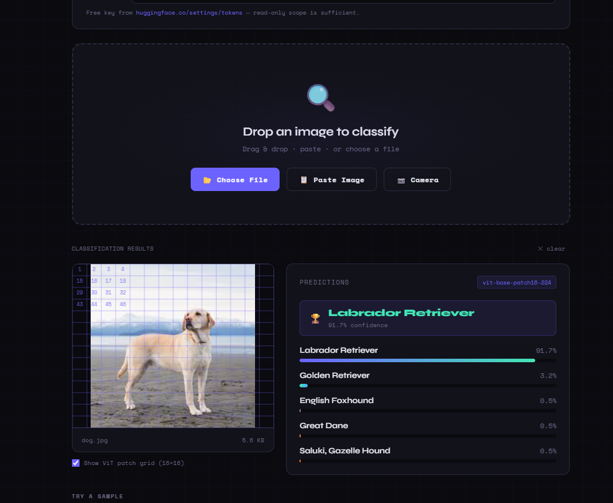

# 🔍 ViT Vision — Image Classifier

A production-ready, zero-dependency web app that classifies images using **Google's Vision Transformer (ViT)** model via the HuggingFace Inference API.

> Built to make the theory from [Vision Transformers](https://vizuara.substack.com) tangible and interactive.

## 🌐 Live Demo

**[→ Try it live: nosainwe.github.io/computer-vision-projects/vit-image-classifier/](https://nosainwe.github.io/computer-vision-projects/vit-image-classifier/)**



---

## ✨ Features

- **Drag & drop** any image to classify
- **Paste** an image from your clipboard (Ctrl+V / Cmd+V)
- **Camera capture** — take a photo and classify it instantly
- **Sample images** — one-click demo with built-in examples (no external requests)
- **ViT Patch Grid toggle** — visualize how ViT slices your image into 14×14 tokens
- **Top-5 predictions** with animated confidence bars
- Zero build step — pure HTML/CSS/JS, open `index.html` and go

---

## 🧠 The Model

| Property | Value |
|---|---|
| Model | `google/vit-base-patch16-224` |
| Pretrained on | ImageNet-21k |
| Fine-tuned on | ImageNet-1k |
| Input size | 224×224 px |
| Patch size | 16×16 px |
| Patches per image | 196 (14×14 grid) + 1 CLS token |
| Embedding dim | 768 |
| Attention heads | 12 |
| Encoder layers | 12 |
| Parameters | ~86M |
| Output classes | 1,000 (ImageNet categories) |

---

## 🚀 Quick Start

### 1. Get a free HuggingFace token

1. Create a free account at [huggingface.co](https://huggingface.co)
2. Go to [huggingface.co/settings/tokens](https://huggingface.co/settings/tokens)
3. Click **New token** → under **Inference** check **"Make calls to Inference Providers"** → copy it

### 2. Open the app

Just open the [live demo](https://nosainwe.github.io/computer-vision-projects/vit-image-classifier/) — no install needed.

Or clone and run locally:
```bash
git clone https://github.com/nosainwe/computer-vision-projects.git
cd computer-vision-projects/vit-image-classifier
open index.html   # Mac — or just double-click on Windows/Linux
```

> **No server required.** This is a single static HTML file.

### 3. Classify an image

1. Paste your `hf_...` token in the field at the top
2. Drag & drop any image (or use Choose File / Camera)
3. See top-5 predictions with confidence scores instantly

---

## 🏗️ How It Works (ViT Explained)

ViT treats an image the same way a language model treats text — as a **sequence of tokens**.

```
Image (224×224×3)
    ↓  slice into patches
196 patches × (16×16×3)
    ↓  flatten + linear projection
196 × 768 patch embeddings
    ↓  prepend CLS token
197 × 768 sequence
    ↓  + positional embeddings
197 × 768 (with position info)
    ↓  12× Transformer Encoder Block
        ├─ Multi-Head Self-Attention (12 heads)
        ├─ Add & LayerNorm
        ├─ Feed-Forward MLP
        └─ Add & LayerNorm
    ↓  CLS token final state (768-dim)
    ↓  MLP head
1000 class logits → softmax → top-5 predictions
```

### Why self-attention beats convolutions here

A CNN's receptive field grows only as layers stack — distant parts of an image only "meet" deep in the network.

ViT's self-attention is **global from layer 1**: the patch showing a cat's eye can directly attend to every other patch immediately. This makes ViT especially powerful for long-range dependencies and transfer learning from massive datasets.

---

## 📁 Project Structure

```
vit-image-classifier/
├── index.html        ← The entire app (HTML + CSS + JS, ~75KB)
├── screenshot.png    ← Demo screenshot
└── README.md         ← This file
```

---

## 🔧 Customization

### Use a different model

Change the `MODEL` constant in the `<script>` block of `index.html`:

```js
const MODEL = 'google/vit-base-patch16-224';    // default
const MODEL = 'google/vit-large-patch16-224';   // larger, more accurate
const MODEL = 'microsoft/resnet-50';            // CNN baseline to compare
const MODEL = 'facebook/deit-base-patch16-224'; // Data-efficient ViT
```

### Run local inference (no token needed)

```bash
pip install transformers torch pillow flask flask-cors
python server.py
```

Then change `API_URL` in `index.html` to `http://localhost:8000/classify`.

---

## 📚 Learn More

- [Vision Transformer paper — Dosovitskiy et al., 2020](https://arxiv.org/abs/2010.11929)
- [HuggingFace model card](https://huggingface.co/google/vit-base-patch16-224)
- [Vizuara — Vision Transformers article](https://vizuara.substack.com)

---

## 📜 License

MIT — free to use, modify, and deploy.
